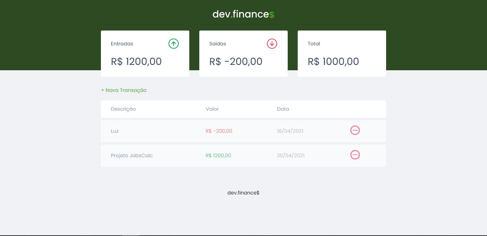

<h1 align="center">
  dev.finance<strong style="font-size:24px; color:green;">&dollar;</strong>
</h1>

<p align="center">
  <a href="#-tecnologias">Tecnologias</a>&nbsp;&nbsp;&nbsp;|&nbsp;&nbsp;&nbsp;
  <a href="#-projeto">Projeto</a>&nbsp;&nbsp;&nbsp;|&nbsp;&nbsp;&nbsp;
  <a href="#-usar">Usar</a>&nbsp;&nbsp;&nbsp;|&nbsp;&nbsp;&nbsp;
  <a href="#memo-licença">Licença</a>
</p>

<p align="center">
 
  
</p>

<p align="center">
  
</p>

## 🚀 Tecnologias

Esse projeto foi desenvolvido com as seguintes tecnologias:

- HTML
- CSS
- JavaScript
- NodeJS
- EJS
- Express

## 💻 Projeto

O dev.finance$ é uma aplicação de cálculos de finanças, onde é possível cadastrar e excluir contas, obtendo uma estimativa entrada, saída e total de renda.

## Usar

Para usar e experimentar esse projeto é necessário ter o NodeJS instalado na sua máquina. Além do Node é preciso ter o EJS, Express e o Nodemon como dependência de desenvolvimento.

Para iniciar o projeto execute o comando, para baixar todas as dependências necessárias:

```bash
npm install 
```

Após a instalação das dependências o projeto está pronto para ser executado na sua máquina local usando:

```bash
npm run dev
```

Para visualizar a aplicação vá para **localhost:3000** no seu navegador e o projeto deve ser exibido.

## :memo: Licença

Esse projeto está sob a licença MIT. Veja o arquivo [LICENSE](.github/LICENSE.md) para mais detalhes.

---

Feito com ♥ by José Ulisses & Rocketseat :wave: [Participe da nossa comunidade!](https://discordapp.com/invite/gCRAFhc)
